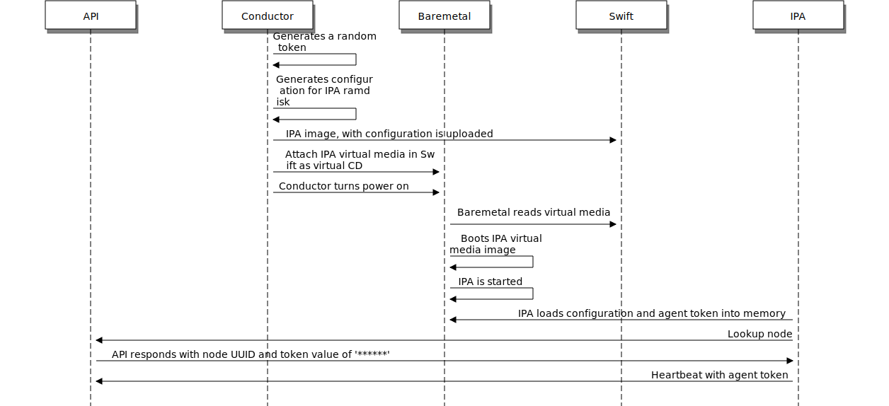
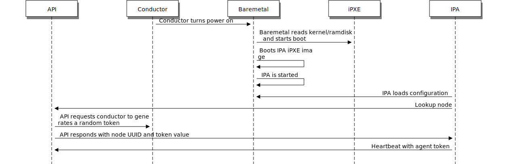

.. _agent_token:

===========
Agent Token
===========

Purpose
=======

The concept of agent tokens is to provide a mechanism by which the
relationship between an operating deployment of the Bare Metal Service
and an instance of the ``ironic-python-agent`` is verified. In a sense,
this token can be viewed as a session identifier or authentication token.

.. warning::
   This functionality does not remove the risk of a man-in-the-middle attack
   that could occur from connection intercept or when TLS is not used for
   all communication.

This becomes useful in the case of deploying an "edge" node where intermediate
networks are not trustworthy.

How it works
============

These tokens are provided in one of two ways to the running agent.

1. A pre-generated token which is embedded into virtual media ISOs.
2. A one-time generated token that are provided upon the first "lookup"
   of the node.

In both cases, the tokens are a randomly generated using the Python
``secrets`` library. As of mid-2020, the default length is 43 characters.

Once the token has been provided, the token cannot be retrieved or accessed.
It remains available to the conductors, and is stored in memory of the
``ironic-python-agent``.

.. note::
   In the case of the token being embedded with virtual media, it is read
   from a configuration file with-in the image. Ideally this should be paired
   with Swift temporary URLs.

With the token is available in memory in the agent, the token is embedded with
``heartbeat`` operations to the ironic API endpoint. This enables the API to
authenticate the heartbeat request, and refuse "heartbeat" requests from the
``ironic-python-agent``. As of the Victoria release, use of Agent Token is
required for all agents and the previously available setting to force this
functionality to be mandatory, ``[DEFAULT]require_agent_token`` no longer has
any effect.

.. warning::
   If the Bare Metal Service is updated, and the version of
   ``ironic-python-agent`` should be updated to enable this feature.

In addition to heartbeats being verified, commands from the
``ironic-conductor`` service to the ``ironic-python-agent`` also include the
token, allowing the agent to authenticate the caller.

With Virtual Media
------------------

With PXE/iPXE/etc.
------------------

Agent Configuration
===================

An additional setting which may be leveraged with the ``ironic-python-agent``
is a ``agent_token_required`` setting. Under normal circumstances, this
setting can be asserted via the configuration supplied from the Bare Metal
service deployment upon the ``lookup`` action, but can be asserted via the
embedded configuration for the agent in the ramdisk. This setting is also
available via kernel command line as ``ipa-agent-token-required``.

