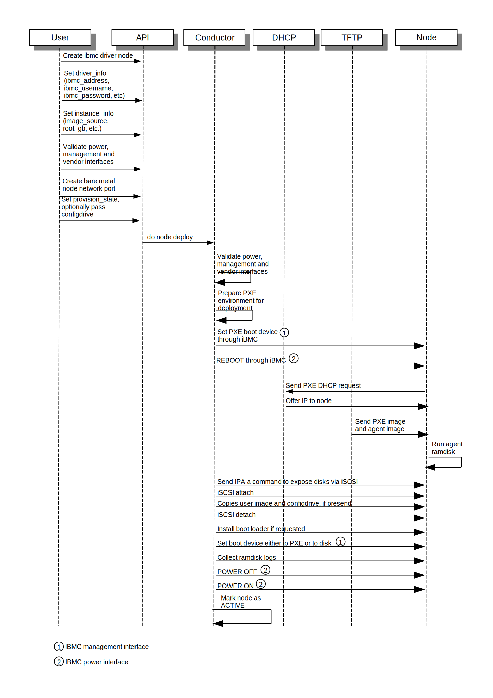

===============
iBMC driver
===============

.. warning::
   The ``ibmc`` driver has been deprecated due to a lack of a functioning
   third party CI and will be removed in the Victoria development cycle.

Overview
========

The ``ibmc`` driver is targeted for Huawei V5 series rack server such as
2288H V5, CH121 V5. The iBMC hardware type enables the user to take advantage
of features of `Huawei iBMC`_ to control Huawei server.

Prerequisites
=============

The `HUAWEI iBMC Client library`_ should be installed on the ironic conductor
  node(s).

For example, it can be installed with ``pip``::

    sudo pip install python-ibmcclient

Enabling the iBMC driver
============================

#. Add ``ibmc`` to the list of ``enabled_hardware_types``,
   ``enabled_power_interfaces``, ``enabled_vendor_interfaces``
   and ``enabled_management_interfaces`` in ``/etc/ironic/ironic.conf``. For example::

    [DEFAULT]
    ...
    enabled_hardware_types = ibmc,ipmi
    enabled_power_interfaces = ibmc,ipmitool
    enabled_management_interfaces = ibmc,ipmitool
    enabled_vendor_interfaces = ibmc

#. Restart the ironic conductor service::

    sudo service ironic-conductor restart

    # Or, for RDO:
    sudo systemctl restart openstack-ironic-conductor

Registering a node with the iBMC driver
===========================================

Nodes configured to use the driver should have the ``driver`` property
set to ``ibmc``.

The following properties are specified in the node's ``driver_info``
field:

- ``ibmc_address``:

  The URL address to the ibmc controller. It must
  include the authority portion of the URL, and can
  optionally include the scheme. If the scheme is
  missing, https is assumed.
  For example: https://ibmc.example.com. This is required.

- ``ibmc_username``:

  User account with admin/server-profile access
  privilege. This is required.

- ``ibmc_password``:

  User account password. This is required.

- ``ibmc_verify_ca``:

  If ibmc_address has the **https** scheme, the
  driver will use a secure (TLS_) connection when
  talking to the ibmc controller. By default
  (if this is set to True), the driver will try to
  verify the host certificates. This can be set to
  the path of a certificate file or directory with
  trusted certificates that the driver will use for
  verification. To disable verifying TLS_, set this
  to False. This is optional.

The ``openstack baremetal node create`` command can be used to enroll
a node with the ``ibmc`` driver. For example:

.. code-block:: bash

  openstack baremetal node create --driver ibmc
    --driver-info ibmc_address=https://example.com \
    --driver-info ibmc_username=admin \
    --driver-info ibmc_password=password

For more information about enrolling nodes see :ref:`enrollment`
in the install guide.

Features of the ``ibmc`` hardware type
=========================================

Query boot up sequence
^^^^^^^^^^^^^^^^^^^^^^

The ``ibmc`` hardware type can query current boot up sequence from the
bare metal node

.. code-block:: bash

  openstack baremetal node passthru call --http-method GET \
    <node id or node name> boot_up_seq

PXE Boot and iSCSI Deploy Process with Ironic Standalone Environment
====================================================================

.. _Huawei iBMC: https://e.huawei.com/en/products/cloud-computing-dc/servers/accessories/ibmc
.. _TLS: https://en.wikipedia.org/wiki/Transport_Layer_Security
.. _HUAWEI iBMC Client library: https://pypi.org/project/python-ibmcclient/
