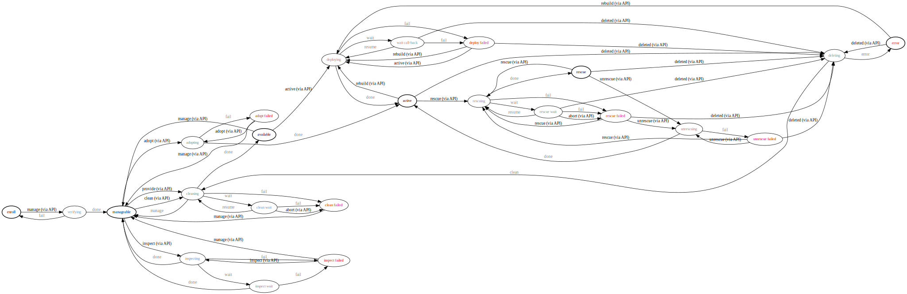

.. _states:

======================
Ironic's State Machine
======================

State Machine Diagram
=====================

The diagram below shows the provisioning states that an Ironic node goes
through during the lifetime of a node. The diagram also depicts the events
that transition the node to different states.

Stable states are highlighted with a thicker border. All transitions from
stable states are initiated by API requests. There are a few other
API-initiated-transitions that are possible from non-stable states.
The events for these API-initiated transitions are indicated with '(via API)'.
Internally, the conductor initiates the other transitions (depicted in gray).

.. note::

    For more information about the states, see the specification located at
    `ironic-state-machine`_.

.. _ironic-state-machine: http://specs.openstack.org/openstack/ironic-specs/specs/kilo-implemented/new-ironic-state-machine.html
