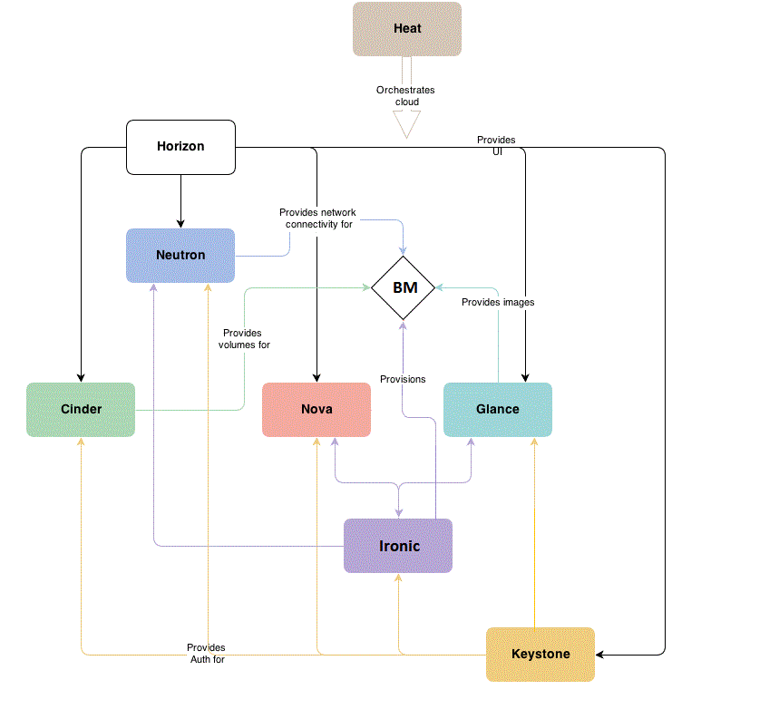
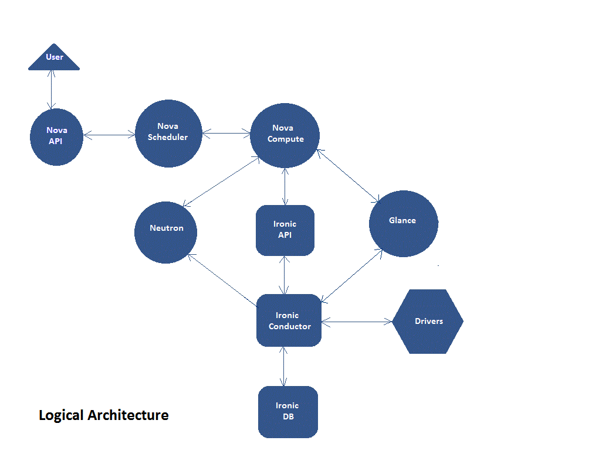

.. _user-guide:

=======================
Introduction to Ironic
=======================
|
     Ironic is an OpenStack project which provisions physical hardware as opposed to virtual machines.
     Ironic provides several reference drivers which leverage common technologies like PXE and IPMI, to
     cover a wide range of hardware. Ironic's pluggable driver architecture also allows vendor-specific
     drivers to be added for improved performance or functionality not provided by reference drivers.
|
     If one thinks of traditional hypervisor functionality (e.g., creating a VM, enumerating virtual devices, managing
     the power state, loading an OS onto the VM, and so on), then Ironic may be thought of as a hypervisor API gluing
     together multiple drivers, each of which implement some portion of that functionality with respect to physical hardware.
|
|
     Openstack's Ironic project makes physical servers as easy to provision as virtual machines in cloud, which in turn will
     open up new avenues for enterprises and service providers.
|
     Ironic's driver will replace the Nova "bare metal" driver of Grizzly, Havana and Icehouse releases. It is targeting inclusion
     in the OpenStack Juno release. See https://wiki.openstack.org/wiki/Baremetal for more information.
|
|
Why Provision Bare Metal
==========================
|
     Here are a few use-cases for bare metal (physical server) provisioning in cloud; there are doubtless many more interesting ones.
|
|
        1.  High-performance computing clusters
|
        2.  Computing tasks that require access to hardware devices which can't be virtualized
|
        3.  Database hosting (some databases run poorly in a hypervisor)
|
        4.  Single tenant, dedicated hardware for performance, security, dependability and other regulatory requirements
|
        5.  Or, rapidly deploying a cloud infrastructure
|
|
Conceptual Architecture
========================
|
     The following diagram shows the relationships and how all services come into play during the provisioning of a
     physical server.
|

|
|
Logical Architecture
=====================
|
     To successfully deploy the Ironic service in cloud, the administrator users need to understand the logical architecture.
     The below diagram shows the basic components that form the Ironic service, the relation of Ironic service with other
     Openstack services and the logical flow of a boot instance request resulting in the provisioning of a physical server.
|
|

|
     The Ironic service is composed of the following components,
|
|
     1.  A RESTful API service, by which operators and other services may interact with the managed bare metal servers.
|
|
     2.  A Conductor service, which does the bulk of the work. Functionality is exposed via the API service.
         The Conductor and API services communicate via RPC.
|
|
     3.  A Message Queue
|
|
     4.  A Database for storing the state of the Conductor and Drivers.
|
|
     As in Figure 1.2. Logical Architecture, a user request to boot an instance is passed to the Nova Compute service
     via Nova API and Nova Scheduler. The Compute service hands over this request to the Ironic service, which comprises
     of the Ironic API, the Ironic Conductor, many Drivers to support heterogeneous hardware, Database etc. The request
     passes from the Ironic API, to the Conductor and the Drivers to successfully provision a physical server to the user.

|
     Just as Nova Compute service talks to various Openstack services like Glance, Neutron, Swift etc to provision a
     virtual machine instance, here the Ironic service talks to the same Openstack services for image, network and other
     resource needs to provision a bare metal instance.

|
|
Key Technologies for Bare Metal Hosting
===========================================
|
PXE
-----
|
        Preboot Execution Environment (PXE) is part of the Wired for Management (WfM) specification developed by Intel and Microsoft.
The PXE enables system's BIOS and network interface card (NIC) to bootstrap a computer from the network in place of a disk. Bootstrapping is the process by which a system loads the OS into local memory so that it can be executed by the processor.
This capability of allowing a system to boot over a network simplifies server deployment and server management for administrators.

|
DHCP
------
|
        Dynamic Host Configuration Protocol (DHCP) is a standardized networking protocol used on Internet Protocol (IP) networks for dynamically distributing network configuration parameters, such as IP addresses for interfaces and services.
Using PXE, the BIOS uses DHCP to obtain an IP address for the network interface and to locate the server that stores the network bootstrap program (NBP).

|
NBP
------
|
        Network Bootstrap Program (NBP) is equivalent to GRUB (GRand Unified Bootloader) or LILO (LInux LOader) - loaders which are traditionally used in local booting. Like the boot program in a hard drive environment, the NBP is responsible for loading the OS kernel into memory so that the OS can be bootstrapped over a network.

|
TFTP
------
|
        Trivial File Transfer Protocol (TFTP) is a simple file transfer protocol that is generally used for automated transfer of configuration or boot files between machines in a local environment.
In a PXE environment, TFTP is used to download NBP over the network using information from the DHCP server.

|
IPMI
------
|
        Intelligent Platform Management Interface (IPMI) is a standardized computer system interface used by system administrators for out-of-band management of computer systems and monitoring of their operation.
It is a method to manage systems that may be unresponsive or powered off by using only a network connection to the hardware rather than to an operating system.

