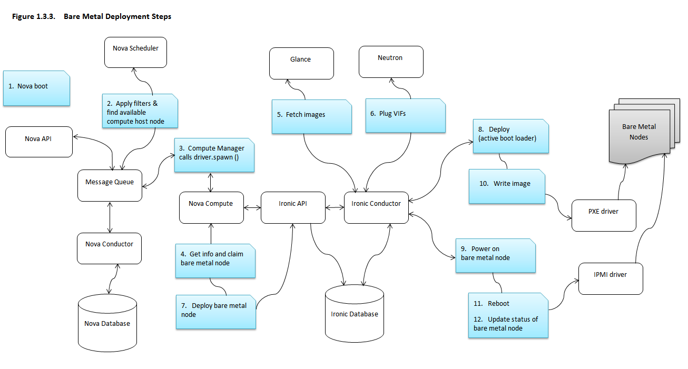

.. _user-guide:

=======================
Introduction to Ironic
=======================

Ironic is an OpenStack project which provisions physical hardware as opposed to
virtual machines.  Ironic provides several reference drivers which leverage
common technologies like PXE and IPMI, to cover a wide range of hardware.
Ironic's pluggable driver architecture also allows vendor-specific drivers to
be added for improved performance or functionality not provided by reference
drivers.

If one thinks of traditional hypervisor functionality (e.g., creating a
VM, enumerating virtual devices, managing the power state, loading an OS onto
the VM, and so on), then Ironic may be thought of as a hypervisor API gluing
together multiple drivers, each of which implement some portion of that
functionality with respect to physical hardware.

OpenStack's Ironic project makes physical servers as easy to provision as
virtual machines in cloud, which in turn will open up new avenues for
enterprises and service providers.

Ironic's driver replaces the Nova "bare metal" driver (in Grizzly - Juno
releases). Ironic is available for use and is supported by the Ironic
developers starting with the Juno release. It is officially integrated with
OpenStack in the Kilo release.

See https://wiki.openstack.org/wiki/Ironic for links to the project's current
development status.

Why Provision Bare Metal
========================

Here are a few use-cases for bare metal (physical server) provisioning in
cloud; there are doubtless many more interesting ones:

- High-performance computing clusters
- Computing tasks that require access to hardware devices which can't be
  virtualized
- Database hosting (some databases run poorly in a hypervisor)
- Single tenant, dedicated hardware for performance, security, dependability
  and other regulatory requirements
- Or, rapidly deploying a cloud infrastructure

Conceptual Architecture
=======================

The following diagram shows the relationships and how all services come into
play during the provisioning of a physical server. (Note that Swift can be
used with Ironic, but is missing from this diagram.)

.. figure:: ../images/conceptual_architecture.png
   :alt: ConceptualArchitecture

Logical Architecture
====================

The diagram below shows the logical architecture. It shows the basic
components that form the Ironic service, the relation of Ironic service with
other OpenStack services and the logical flow of a boot instance request
resulting in the provisioning of a physical server.

.. figure:: ../images/logical_architecture.png
   :alt: Logical Architecture

The Ironic service is composed of the following components:

#. a RESTful API service, by which operators and other services may interact
   with the managed bare metal servers.

#. a Conductor service, which does the bulk of the work. Functionality is
   exposed via the API service. The Conductor and API services communicate
   via RPC.

#. various Drivers that support heterogenous hardware

#. a Message Queue

#. a Database for storing information about the resources. Among other things,
   this includes the state of the conductors, nodes (physical servers), and
   drivers.

As in Figure 1.2. Logical Architecture, a user request to boot an instance is
passed to the Nova Compute service via Nova API and Nova Scheduler. The Compute
service hands over this request to the Ironic service, where the request passes
from the Ironic API, to the Conductor, to a Driver to successfully provision a
physical server for the user.

Just as the Nova Compute service talks to various OpenStack services like
Glance, Neutron, Swift etc to provision a virtual machine instance, here the
Ironic service talks to the same OpenStack services for image, network and
other resource needs to provision a bare metal instance.

Key Technologies for Bare Metal Hosting
=======================================

PXE
-----
Preboot Execution Environment (PXE) is part of the Wired for Management (WfM)
specification developed by Intel and Microsoft.  The PXE enables system's BIOS
and network interface card (NIC) to bootstrap a computer from the network in
place of a disk. Bootstrapping is the process by which a system loads the OS
into local memory so that it can be executed by the processor.  This capability
of allowing a system to boot over a network simplifies server deployment and
server management for administrators.

DHCP
------
Dynamic Host Configuration Protocol (DHCP) is a standardized networking
protocol used on Internet Protocol (IP) networks for dynamically distributing
network configuration parameters, such as IP addresses for interfaces and
services. Using PXE, the BIOS uses DHCP to obtain an IP address for the
network interface and to locate the server that stores the network bootstrap
program (NBP).

NBP
------
Network Bootstrap Program (NBP) is equivalent to GRUB (GRand Unified
Bootloader) or LILO (LInux LOader) - loaders which are traditionally used in
local booting. Like the boot program in a hard drive environment, the NBP is
responsible for loading the OS kernel into memory so that the OS can be
bootstrapped over a network.

TFTP
------
Trivial File Transfer Protocol (TFTP) is a simple file transfer protocol that
is generally used for automated transfer of configuration or boot files between
machines in a local environment.  In a PXE environment, TFTP is used to
download NBP over the network using information from the DHCP server.

IPMI
------
Intelligent Platform Management Interface (IPMI) is a standardized computer
system interface used by system administrators for out-of-band management of
computer systems and monitoring of their operation.  It is a method to manage
systems that may be unresponsive or powered off by using only a network
connection to the hardware rather than to an operating system.

Ironic Deployment Architecture
==============================

The Ironic RESTful API service is used to enroll hardware that Ironic will
manage. A cloud administrator usually registers the hardware, specifying their
attributes such as MAC addresses and IPMI credentials. There can be multiple
instances of the API service.

The Ironic conductor service does the bulk of the work.
For security reasons, it is advisable to place the conductor service on
an isolated host, since it is the only service that requires access to both
the data plane and IPMI control plane.

There can be multiple instances of the conductor service to support
various class of drivers and also to manage fail over. Instances of the
conductor service should be on separate nodes. Each conductor can itself run
many drivers to operate heterogeneous hardware. This is depicted in the
following figure.

The API exposes a list of supported drivers and the names of conductor hosts
servicing them.

.. figure:: ../images/deployment_architecture_2.png
   :alt: Deployment Architecture 2

Understanding Bare Metal Deployment
===================================

What happens when a boot instance request comes in? The below diagram walks
through the steps involved during the provisioning of a bare metal instance.

These pre-requisites must be met before the deployment process:

- Dependent packages to be configured on the compute node like tftp-server,
  ipmi, syslinux etc for bare metal provisioning.
- Flavors to be created for the available hardware. Nova must know the flavor
  to boot from.
- Images to be made available in Glance. Listed below are some image types
  required for successful bare metal deployment:

     +  bm-deploy-kernel
     +  bm-deploy-ramdisk
     +  user-image
     +  user-image-vmlinuz
     +  user-image-initrd
- Hardware to be enrolled via Ironic RESTful API service.

Deploy Process
-----------------

#. A boot instance request comes in via the Nova API, through the message
   queue to the Nova scheduler.

#. Nova scheduler applies filter and finds the eligible compute node. Nova
   scheduler uses flavor extra_specs detail such as 'cpu_arch',
   'baremetal:deploy_kernel_id', 'baremetal:deploy_ramdisk_id' etc to match
   the target physical node.

#. A spawn task is placed by the driver which contains all information such
   as which image to boot from etc. It invokes the driver.spawn from the
   virt layer of Nova compute.

#. Information about the bare metal node is retrieved from the bare metal
   database and the node is reserved.

#. Images from Glance are pulled down to the local disk of the Ironic
   conductor servicing the bare metal node.

#. Virtual interfaces are plugged in and Neutron API updates DHCP port to
   support PXE/TFTP options.

#. Nova's ironic driver issues a deploy request via the Ironic API to the
   Ironic conductor servicing the bare metal node.

#. PXE driver prepares tftp bootloader.

#. The IPMI driver issues command to enable network boot of a node and power
   it on.

#. The DHCP boots the deploy ramdisk. The PXE driver actually copies the image
   over iSCSI to the physical node. It connects to the iSCSI end point,
   partitions volume, "dd" the image and closes the iSCSI connection. The
   deployment is done. The Ironic conductor will switch pxe config to service
   mode and notify ramdisk agent on the successful deployment.

#. The IPMI driver reboots the bare metal node. Note that there are 2 power
   cycles during bare metal deployment; the first time when powered-on, the
   images get deployed as mentioned in step 9. The second time as in this case,
   after the images are deployed, the node is powered up.

#. The bare metal node status is updated and the node instance is made
   available.
