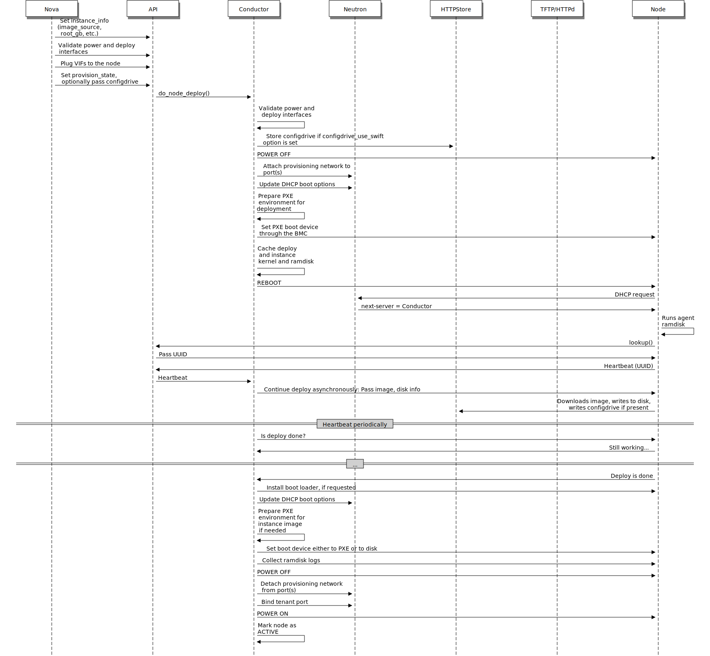

===========================
Overview of Ironic
===========================

The Bare Metal service, codenamed ``ironic``, is a collection of components
that provides support to manage and provision physical machines.

Why Provision Bare Metal
--------------------------

Here are a few use-cases for bare metal (physical server) provisioning in
cloud; there are doubtless many more interesting ones:

- High-performance computing clusters
- Computing tasks that require access to hardware devices which can't be
  virtualized
- Database hosting (some databases run poorly in a hypervisor)
- Single tenant, dedicated hardware for performance, security, dependability
   and other regulatory requirements
- Or, rapidly deploying a cloud infrastructure

Bare Metal service components
-----------------------------

The Bare Metal service includes the following components:

ironic-api
  A RESTful API that processes application requests by sending them to the
  ironic-conductor over `remote procedure call (RPC)`_. Can be run through
  WSGI_ or as a separate process.

ironic-conductor
  Adds/edits/deletes nodes; powers on/off nodes with IPMI or other
  vendor-specific protocol; provisions/deploys/cleans bare metal nodes.

  ironic-conductor uses :doc:`drivers </install/enabling-drivers>` to execute
  operations on hardware.

ironic-python-agent
  A python service which is run in a temporary ramdisk to provide
  ironic-conductor and ironic-inspector services with remote access, in-band
  hardware control, and hardware introspection.

ironic-novncproxy
  A python service which proxies graphical consoles from hosts using the
  NoVNC web browser interface.

Additionally, the Bare Metal service has certain external dependencies, which
are very similar to other OpenStack services:

- A database to store hardware information and state. You can set the database
  back-end type and location. A simple approach is to use the same database
  back end as the Compute service. Another approach is to use a separate
  database back-end to further isolate bare metal resources (and associated
  metadata) from users.

- An :oslo.messaging-doc:`oslo.messaging <>`
  compatible queue, such as RabbitMQ. It may use the same
  implementation as that of the Compute service, but that is not a requirement.
  Used to implement RPC between ironic-api and ironic-conductor.

Interaction with OpenStack components
-------------------------------------

The Bare Metal service may, depending upon configuration, interact with several
other OpenStack services. This includes:

- the OpenStack Telemetry module (``ceilometer``) for consuming the IPMI
  metrics
- the OpenStack Identity service (``keystone``) for request authentication and
  to locate other OpenStack services
- the OpenStack Image service (``glance``) from which to retrieve images and
  image meta-data
- the OpenStack Networking service (``neutron``) for DHCP and network
  configuration
- the OpenStack Compute service (``nova``) works with the Bare Metal service
  and acts as a user-facing API for instance management, while the Bare Metal
  service provides the admin/operator API for hardware management.  The
  OpenStack Compute service also provides scheduling facilities (matching
  flavors <-> images <-> hardware), tenant quotas, IP assignment, and other
  services which the Bare Metal service does not, in and of itself, provide.
- the OpenStack Object Storage (``swift``) provides temporary storage
  for the configdrive, user images, deployment logs and inspection data.

Logical architecture
--------------------

The diagram below shows the logical architecture. It shows the basic
components that form the Bare Metal service, the relation of the Bare Metal
service with other OpenStack services and the logical flow of a boot instance
request resulting in the provisioning of a physical server.

.. figure:: ../images/logical_architecture.png
   :alt: Logical Architecture

A user's request to boot an instance is passed to the Compute service via
the Compute API and the Compute Scheduler. The Compute service uses the
*ironic virt driver* to hand over this request to the Bare Metal service,
where the request passes from the Bare Metal API, to the Conductor, to a Driver
to successfully provision a physical server for the user.

Just as the Compute service talks to various OpenStack services like
Image, Network, Object Store etc to provision a virtual machine instance, here
the Bare Metal service talks to the same OpenStack services for image, network
and other resource needs to provision a bare metal instance.

See :ref:`understanding-deployment` for a more detailed breakdown of
a typical deployment process.

Associated projects
-------------------

Optionally, one may wish to utilize the following associated projects for
additional functionality:

:python-ironicclient-doc:`python-ironicclient <>`
  A command-line interface (CLI) and python bindings for interacting with the
  Bare Metal service.

:ironic-ui-doc:`ironic-ui <>`
  Horizon dashboard, providing graphical interface (GUI) for the Bare Metal
  API.

:ironic-inspector-doc:`ironic-inspector <>`
  An associated service which performs in-band hardware introspection by
  PXE booting unregistered hardware into the ironic-python-agent ramdisk.

diskimage-builder_
  A related project to help facilitate the creation of ramdisks and machine
  images, such as those running the ironic-python-agent.

:bifrost-doc:`bifrost <>`
  A set of Ansible playbooks that automates the task of deploying a base image
  onto a set of known hardware using ironic in a standalone mode.

.. _remote procedure call (RPC): https://en.wikipedia.org/wiki/Remote_procedure_call
.. _WSGI: https://en.wikipedia.org/wiki/Web_Server_Gateway_Interface
.. _diskimage-builder: https://docs.openstack.org/diskimage-builder/latest/

Key Technologies for Bare Metal Hosting
=======================================

Preboot Execution Environment (PXE)
-----------------------------------
PXE is part of the Wired for Management (WfM) specification developed by Intel
and Microsoft. The PXE enables system's BIOS and network interface card (NIC)
to bootstrap a computer from the network in place of a disk. Bootstrapping is
the process by which a system loads the OS into local memory so that it can be
executed by the processor. This capability of allowing a system to boot over a
network simplifies server deployment and server management for administrators.

Dynamic Host Configuration Protocol (DHCP)
------------------------------------------
DHCP is a standardized networking protocol used on Internet Protocol (IP)
networks for dynamically distributing network configuration parameters, such
as IP addresses for interfaces and services. Using PXE, the BIOS uses DHCP to
obtain an IP address for the network interface and to locate the server that
stores the network bootstrap program (NBP).

Network Bootstrap Program (NBP)
-------------------------------
NBP is equivalent to GRUB (GRand Unified Bootloader) or LILO (LInux LOader) -
loaders which are traditionally used in local booting. Like the boot program
in a hard drive environment, the NBP is responsible for loading the OS kernel
into memory so that the OS can be bootstrapped over a network.

Trivial File Transfer Protocol (TFTP)
-------------------------------------
TFTP is a simple file transfer protocol that is generally used for automated
transfer of configuration or boot files between machines in a local
environment.  In a PXE environment, TFTP is used to download NBP over the
network using information from the DHCP server.

Intelligent Platform Management Interface (IPMI)
------------------------------------------------
IPMI is a standardized computer system interface used by system administrators
for out-of-band management of computer systems and monitoring of their
operation. It is a method to manage systems that may be unresponsive or powered
off by using only a network connection to the hardware rather than to an
operating system.

.. _understanding-deployment:

Understanding Bare Metal Deployment
===================================

What happens when a boot instance request comes in? The below diagram walks
through the steps involved during the provisioning of a bare metal instance.

These pre-requisites must be met before the deployment process:

* Dependent packages to be configured on the Bare Metal service node(s)
  where ironic-conductor is running like tftp-server, ipmi, grub/ipxe, etc
  for bare metal provisioning.
* Nova must be configured to make use of the bare metal service endpoint
  and compute driver should be configured to use ironic driver on the Nova
  compute node(s).
* Flavors to be created for the available hardware. Nova must know the flavor
  to boot from.
* Images to be made available in Glance. Listed below are some image types
  required for successful bare metal deployment:

  -  bm-deploy-kernel
  -  bm-deploy-ramdisk
  -  user-image
  -  user-image-vmlinuz
  -  user-image-initrd

* Hardware to be enrolled via the bare metal API service.

Deploy Process
--------------

This describes a typical bare metal node deployment within OpenStack using PXE
to boot the ramdisk. Depending on the ironic driver interfaces used, some of
the steps might be marginally different, however the majority of them will
remain the same.

#. A boot instance request comes in via the Nova API, through the message
   queue to the Nova scheduler.

#. Nova scheduler applies filters and finds the eligible hypervisor. The nova
   scheduler also uses the flavor's ``extra_specs``, such as ``cpu_arch``, to
   match the target physical node.

#. Nova compute manager claims the resources of the selected hypervisor.

#. Nova compute manager creates (unbound) tenant virtual interfaces (VIFs) in
   the Networking service according to the network interfaces requested in the
   nova boot request. A caveat here is, the MACs of the ports are going to be
   randomly generated, and will be updated when the VIF is attached to some
   node to correspond to the node network interface card's (or bond's) MAC.

#. A spawn task is created by the nova compute which contains all
   the information such as which image to boot from etc. It invokes the
   ``driver.spawn`` from the virt layer of Nova compute. During the spawn
   process, the virt driver does the following:

   #. Updates the target ironic node with the information about deploy image,
      instance UUID, requested capabilities and various flavor properties.

   #. Validates node's power and deploy interfaces, by calling the ironic API.

   #. Attaches the previously created VIFs to the node. Each neutron port can
      be attached to any ironic port or port group, with port groups having
      higher priority than ports. On ironic side, this work is done by the
      network interface. Attachment here means saving the VIF identifier
      into ironic port or port group and updating VIF MAC to match the port's
      or port group's MAC, as described in bullet point 4.

   #. Generates config drive, if requested.

#. Nova's ironic virt driver issues a deploy request via the Ironic API to the
   Ironic conductor servicing the bare metal node.

#. Virtual interfaces are plugged in and Neutron API updates DHCP port to
   set PXE/TFTP options. In case of using ``neutron`` network interface,
   ironic creates separate provisioning ports in the Networking service, while
   in case of ``flat`` network interface, the ports created by nova are used
   both for provisioning and for deployed instance networking.

#. The ironic node's boot interface prepares (i)PXE configuration and caches
   deploy kernel and ramdisk.

#. The ironic node's management interface issues commands to enable network
   boot of a node.

#. The ironic node's deploy interface caches the instance image (normal
   deployment), kernel and ramdisk (``ramdisk`` deploy) or ISO (``ramdisk``
   deploy with virtual media).

#. The ironic node's power interface instructs the node to power on.

#. The node boots the deploy ramdisk.

#. Depending on the exact driver used, the deploy ramdisk downloads the image
   from a URL (:ref:`direct-deploy`) or the conductor uses SSH to execute
   commands (:ref:`ansible-deploy`). The URL can be generated by Swift
   API-compatible object stores, for example Swift itself or RadosGW, or
   provided by a user.

   The image deployment is done.

#. The node's boot interface switches pxe config to refer to instance images
   (or, in case of local boot, sets boot device to disk), and asks the ramdisk
   agent to soft power off the node. If the soft power off by the ramdisk agent
   fails, the bare metal node is powered off via IPMI/BMC call.

#. The deploy interface triggers the network interface to remove provisioning
   ports if they were created, and binds the tenant ports to the node if not
   already bound. Then the node is powered on.

   .. note:: There are 2 power cycles during bare metal deployment; the
             first time the node is powered-on when ramdisk is booted, the
             second time after the image is deployed.

#. The bare metal node's provisioning state is updated to ``active``.

Below is the diagram that describes the above process.

.. graphviz::

   digraph "Deployment Steps" {

       node [shape=box, style=rounded, fontsize=10];
       edge [fontsize=10];

       /* cylinder shape works only in graphviz 2.39+ */
       { rank=same; node [shape=cylinder]; "Nova DB"; "Ironic DB"; }
       { rank=same; "Nova API"; "Ironic API"; }
       { rank=same; "Nova Message Queue"; "Ironic Message Queue"; }
       { rank=same; "Ironic Conductor"; "TFTP Server"; }
       { rank=same; "Deploy Interface"; "Boot Interface"; "Power Interface";
                    "Management Interface"; }
       { rank=same; "Glance"; "Neutron"; }
       "Bare Metal Nodes" [shape=box3d];

       "Nova API" -> "Nova Message Queue" [label=" 1"];
       "Nova Message Queue" -> "Nova Conductor" [dir=both];
       "Nova Message Queue" -> "Nova Scheduler" [label=" 2"];
       "Nova Conductor" -> "Nova DB" [dir=both, label=" 3"];
       "Nova Message Queue" -> "Nova Compute" [dir=both];
       "Nova Compute" -> "Neutron" [label=" 4"];
       "Nova Compute" -> "Nova Ironic Virt Driver" [label=5];
       "Nova Ironic Virt Driver" -> "Ironic API" [label=6];
       "Ironic API" -> "Ironic Message Queue";
       "Ironic Message Queue" -> "Ironic Conductor" [dir=both];
       "Ironic API" -> "Ironic DB" [dir=both];
       "Ironic Conductor" -> "Ironic DB" [dir=both, label=16];
       "Ironic Conductor" -> "Boot Interface" [label="8, 14"];
       "Ironic Conductor" -> "Management Interface" [label=" 9"];
       "Ironic Conductor" -> "Deploy Interface" [label=10];
       "Deploy Interface" -> "Network Interface" [label="7, 15"];
       "Ironic Conductor" -> "Power Interface" [label=11];
       "Ironic Conductor" -> "Glance";
       "Network Interface" -> "Neutron";
       "Power Interface" -> "Bare Metal Nodes";
       "Management Interface" -> "Bare Metal Nodes";
       "TFTP Server" -> "Bare Metal Nodes" [label=12];
       "Ironic Conductor" -> "Bare Metal Nodes" [style=dotted, label=13];
       "Boot Interface" -> "TFTP Server";

   }

The following two examples describe what ironic is doing in more detail,
leaving out the actions performed by nova and some of the more advanced
options.

.. _direct-deploy-example:

Example: PXE Boot and Direct Deploy Process
---------------------------------------------

This process is how :ref:`direct-deploy` works.

(From a `talk`_  and `slides`_)

.. _talk: https://www.openstack.org/summit/vancouver-2015/summit-videos/presentation/isn-and-039t-it-ironic-the-bare-metal-cloud
.. _slides: http://www.slideshare.net/devananda1/isnt-it-ironic-managing-a-bare-metal-cloud-osl-tes-2015

Deployment architecture
-----------------------

The Bare Metal RESTful API service is used to enroll hardware that the Bare
Metal service will manage. A cloud administrator usually registers it,
specifying their attributes such as MAC addresses and IPMI credentials.
There can be multiple instances of the API service.

The *ironic-conductor* process does the bulk of the work.  For security
reasons, it is advisable to place it on an isolated host, since it is the only
service that requires access to both the data plane and IPMI control plane.

There can be multiple instances of the conductor service to support
various class of drivers and also to manage fail over. Instances of the
conductor service should be on separate nodes. Each conductor can itself run
many drivers to operate heterogeneous hardware. This is depicted in the
following figure.

.. figure:: ../images/deployment_architecture_2.png
   :alt: Deployment Architecture

The API exposes a list of supported drivers and the names of conductor hosts
servicing them.
