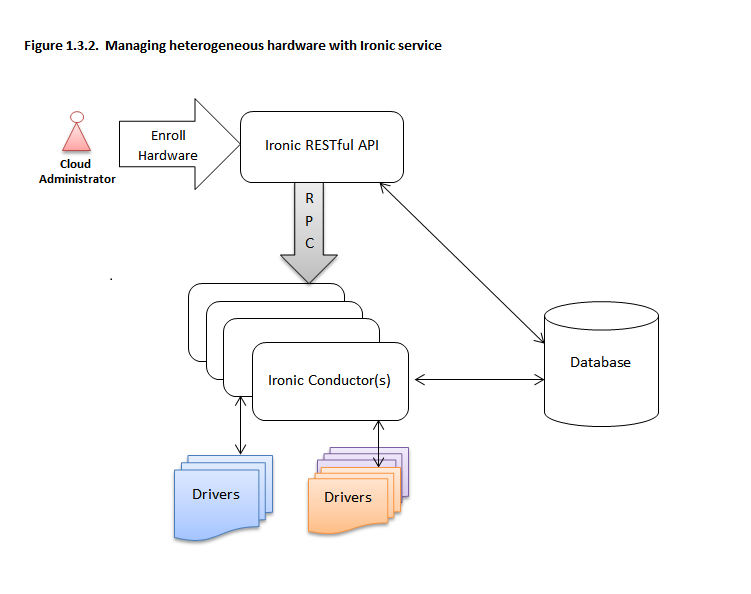
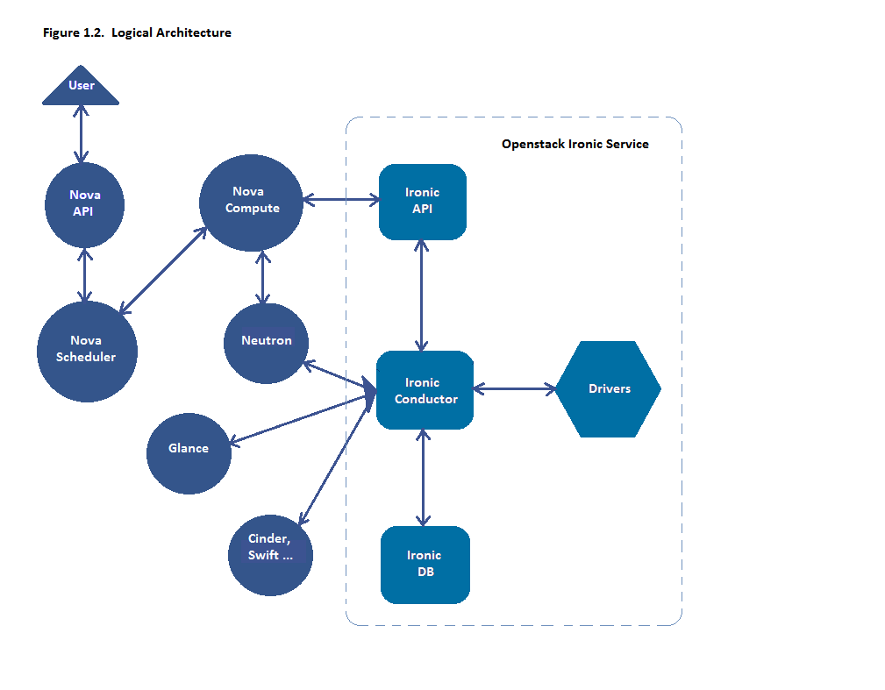

===========================
Bare Metal service overview
===========================

The Bare Metal service, codenamed ``ironic``, is a collection of components
that provides support to manage and provision physical machines.

Bare Metal service components
-----------------------------

The Bare Metal service includes the following components:

ironic-api
  A RESTful API that processes application requests by sending them to the
  ironic-conductor over `remote procedure call (RPC)`_. Can be run through
  WSGI_ or as a separate process.

ironic-conductor
  Adds/edits/deletes nodes; powers on/off nodes with IPMI or other
  vendor-specific protocol; provisions/deploys/cleans bare metal nodes.

  ironic-conductor uses :doc:`drivers </install/enabling-drivers>` to execute
  operations on hardware.

ironic-python-agent
  A python service which is run in a temporary ramdisk to provide
  ironic-conductor and ironic-inspector services with remote access, in-band
  hardware control, and hardware introspection.

Additionally, the Bare Metal service has certain external dependencies, which
are very similar to other OpenStack services:

- A database to store hardware information and state. You can set the database
  back-end type and location. A simple approach is to use the same database
  back end as the Compute service. Another approach is to use a separate
  database back-end to further isolate bare metal resources (and associated
  metadata) from users.

- An oslo.messaging_ compatible queue, such as RabbitMQ. It may use the same
  implementation as that of the Compute service, but that is not a requirement.
  Used to implement RPC between ironic-api and ironic-conductor.

Deployment architecture
-----------------------

The Bare Metal RESTful API service is used to enroll hardware that the Bare
Metal service will manage. A cloud administrator usually registers it,
specifying their attributes such as MAC addresses and IPMI credentials.
There can be multiple instances of the API service.

The *ironic-conductor* process does the bulk of the work.  For security
reasons, it is advisable to place it on an isolated host, since it is the only
service that requires access to both the data plane and IPMI control plane.

There can be multiple instances of the conductor service to support
various class of drivers and also to manage fail over. Instances of the
conductor service should be on separate nodes. Each conductor can itself run
many drivers to operate heterogeneous hardware. This is depicted in the
following figure.

The API exposes a list of supported drivers and the names of conductor hosts
servicing them.

Interaction with OpenStack components
-------------------------------------

The Bare Metal service may, depending upon configuration, interact with several
other OpenStack services. This includes:

- the OpenStack Telemetry module (``ceilometer``) for consuming the IPMI
  metrics
- the OpenStack Identity service (``keystone``) for request authentication and
  to locate other OpenStack services
- the OpenStack Image service (``glance``) from which to retrieve images and
  image meta-data
- the OpenStack Networking service (``neutron``) for DHCP and network
  configuration
- the OpenStack Compute service (``nova``) works with the Bare Metal service
  and acts as a user-facing API for instance management, while the Bare Metal
  service provides the admin/operator API for hardware management.  The
  OpenStack Compute service also provides scheduling facilities (matching
  flavors <-> images <-> hardware), tenant quotas, IP assignment, and other
  services which the Bare Metal service does not, in and of itself, provide.
- the OpenStack Object Storage (``swift``) provides temporary storage
  for the configdrive, user images, deployment logs and inspection data.

Logical architecture
--------------------

The diagram below shows the logical architecture. It shows the basic
components that form the Bare Metal service, the relation of the Bare Metal
service with other OpenStack services and the logical flow of a boot instance
request resulting in the provisioning of a physical server.

A user's request to boot an instance is passed to the Compute service via
the Compute API and the Compute Scheduler. The Compute service uses the
*ironic virt driver* to hand over this request to the Bare Metal service,
where the request passes from the Bare Metal API, to the Conductor, to a Driver
to successfully provision a physical server for the user.

Just as the Compute service talks to various OpenStack services like
Image, Network, Object Store etc to provision a virtual machine instance, here
the Bare Metal service talks to the same OpenStack services for image, network
and other resource needs to provision a bare metal instance.

See :ref:`understanding-deployment` for a more detailed breakdown of
a typical deployment process.

Associated projects
-------------------

Optionally, one may wish to utilize the following associated projects for
additional functionality:

python-ironicclient_
  A command-line interface (CLI) and python bindings for interacting with the
  Bare Metal service.

ironic-ui_
  Horizon dashboard, providing graphical interface (GUI) for the Bare Metal
  API.

ironic-inspector_
  An associated service which performs in-band hardware introspection by
  PXE booting unregistered hardware into the ironic-python-agent ramdisk.

diskimage-builder_
  A related project to help facilitate the creation of ramdisks and machine
  images, such as those running the ironic-python-agent.

bifrost_
  A set of Ansible playbooks that automates the task of deploying a base image
  onto a set of known hardware using ironic in a standalone mode.

.. _remote procedure call (RPC): https://en.wikipedia.org/wiki/Remote_procedure_call
.. _WSGI: https://en.wikipedia.org/wiki/Web_Server_Gateway_Interface
.. _oslo.messaging: https://docs.openstack.org/oslo.messaging/train/
.. _python-ironicclient: https://docs.openstack.org/python-ironicclient/train/
.. _ironic-ui: https://docs.openstack.org/ironic-ui/train/
.. _ironic-inspector: https://docs.openstack.org/ironic-inspector/train/
.. _diskimage-builder: https://docs.openstack.org/diskimage-builder/latest/
.. _bifrost: https://docs.openstack.org/bifrost/train/

