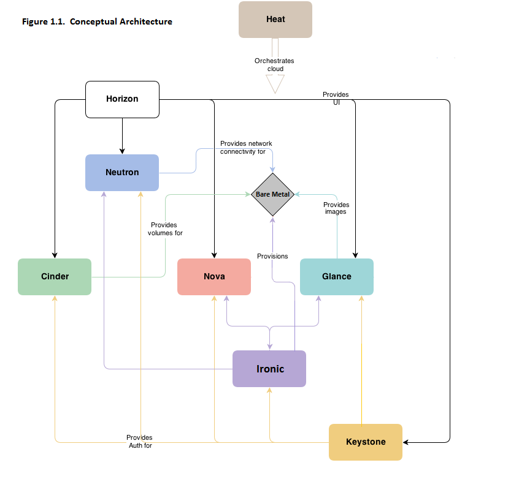

.. _user-guide:

=============================
Bare Metal Service User Guide
=============================

Ironic is an OpenStack project which provisions bare metal (as opposed to
virtual) machines. It may be used independently or as part of an OpenStack
Cloud, and integrates with the OpenStack Identity (keystone), Compute (nova),
Network (neutron), Image (glance) and Object (swift) services.

When the Bare Metal service is appropriately configured with the Compute and
Network services, it is possible to provision both virtual and physical
machines through the Compute service's API. However, the set of instance
actions is limited, arising from the different characteristics of physical
servers and switch hardware. For example, live migration can not be performed
on a bare metal instance.

The community maintains reference drivers that leverage open-source
technologies (eg. PXE and IPMI) to cover a wide range of hardware. Ironic's
pluggable driver architecture also allows hardware vendors to write and
contribute drivers that may improve performance or add functionality not
provided by the community drivers.

.. TODO: the remainder of this file needs to be cleaned up still

Why Provision Bare Metal
========================

Here are a few use-cases for bare metal (physical server) provisioning in
cloud; there are doubtless many more interesting ones:

- High-performance computing clusters
- Computing tasks that require access to hardware devices which can't be
  virtualized
- Database hosting (some databases run poorly in a hypervisor)
- Single tenant, dedicated hardware for performance, security, dependability
  and other regulatory requirements
- Or, rapidly deploying a cloud infrastructure

Conceptual Architecture
=======================

The following diagram shows the relationships and how all services come into
play during the provisioning of a physical server. (Note that Ceilometer and
Swift can be used with Ironic, but are missing from this diagram.)

Key Technologies for Bare Metal Hosting
=======================================

Preboot Execution Environment (PXE)
-----------------------------------
PXE is part of the Wired for Management (WfM) specification developed by Intel
and Microsoft. The PXE enables system's BIOS and network interface card (NIC)
to bootstrap a computer from the network in place of a disk. Bootstrapping is
the process by which a system loads the OS into local memory so that it can be
executed by the processor. This capability of allowing a system to boot over a
network simplifies server deployment and server management for administrators.

Dynamic Host Configuration Protocol (DHCP)
------------------------------------------
DHCP is a standardized networking protocol used on Internet Protocol (IP)
networks for dynamically distributing network configuration parameters, such
as IP addresses for interfaces and services. Using PXE, the BIOS uses DHCP to
obtain an IP address for the network interface and to locate the server that
stores the network bootstrap program (NBP).

Network Bootstrap Program (NBP)
-------------------------------
NBP is equivalent to GRUB (GRand Unified Bootloader) or LILO (LInux LOader) -
loaders which are traditionally used in local booting. Like the boot program
in a hard drive environment, the NBP is responsible for loading the OS kernel
into memory so that the OS can be bootstrapped over a network.

Trivial File Transfer Protocol (TFTP)
-------------------------------------
TFTP is a simple file transfer protocol that is generally used for automated
transfer of configuration or boot files between machines in a local
environment.  In a PXE environment, TFTP is used to download NBP over the
network using information from the DHCP server.

Intelligent Platform Management Interface (IPMI)
------------------------------------------------
IPMI is a standardized computer system interface used by system administrators
for out-of-band management of computer systems and monitoring of their
operation. It is a method to manage systems that may be unresponsive or powered
off by using only a network connection to the hardware rather than to an
operating system.

.. _understanding-deployment:

Understanding Bare Metal Deployment
===================================

What happens when a boot instance request comes in? The below diagram walks
through the steps involved during the provisioning of a bare metal instance.

These pre-requisites must be met before the deployment process:

* Dependent packages to be configured on the Bare Metal service node(s)
  where ironic-conductor is running like tftp-server, ipmi, syslinux etc for
  bare metal provisioning.
* Nova must be configured to make use of the bare metal service endpoint
  and compute driver should be configured to use ironic driver on the Nova
  compute node(s).
* Flavors to be created for the available hardware. Nova must know the flavor
  to boot from.
* Images to be made available in Glance. Listed below are some image types
  required for successful bare metal deployment:

  -  bm-deploy-kernel
  -  bm-deploy-ramdisk
  -  user-image
  -  user-image-vmlinuz
  -  user-image-initrd

* Hardware to be enrolled via the bare metal API service.

Deploy Process
--------------

This describes a typical bare metal node deployment within OpenStack using PXE
to boot the ramdisk. Depending on the ironic driver interfaces used, some of
the steps might be marginally different, however the majority of them will
remain the same.

#. A boot instance request comes in via the Nova API, through the message
   queue to the Nova scheduler.

#. Nova scheduler applies filters and finds the eligible hypervisor. The nova
   scheduler also uses the flavor's ``extra_specs``, such as ``cpu_arch``, to
   match the target physical node.

#. Nova compute manager claims the resources of the selected hypervisor.

#. Nova compute manager creates (unbound) tenant virtual interfaces (VIFs) in
   the Networking service according to the network interfaces requested in the
   nova boot request. A caveat here is, the MACs of the ports are going to be
   randomly generated, and will be updated when the VIF is attached to some
   node to correspond to the node network interface card's (or bond's) MAC.

#. A spawn task is created by the nova compute which contains all
   the information such as which image to boot from etc. It invokes the
   ``driver.spawn`` from the virt layer of Nova compute. During the spawn
   process, the virt driver does the following:

   #. Updates the target ironic node with the information about deploy image,
      instance UUID, requested capabilities and various flavor properties.

   #. Validates node's power and deploy interfaces, by calling the ironic API.

   #. Attaches the previously created VIFs to the node. Each neutron port can
      be attached to any ironic port or port group, with port groups having
      higher priority than ports. On ironic side, this work is done by the
      network interface. Attachment here means saving the VIF identifier
      into ironic port or port group and updating VIF MAC to match the port's
      or port group's MAC, as described in bullet point 4.

   #. Generates config drive, if requested.

#. Nova's ironic virt driver issues a deploy request via the Ironic API to the
   Ironic conductor servicing the bare metal node.

#. Virtual interfaces are plugged in and Neutron API updates DHCP port to
   set PXE/TFTP options. In case of using ``neutron`` network interface,
   ironic creates separate provisioning ports in the Networking service, while
   in case of ``flat`` network interface, the ports created by nova are used
   both for provisioning and for deployed instance networking.

#. The ironic node's boot interface prepares (i)PXE configuration and caches
   deploy kernel and ramdisk.

#. The ironic node's management interface issues commands to enable network
   boot of a node.

#. The ironic node's deploy interface caches the instance image, kernel and
   ramdisk if needed (it is needed in case of netboot for example).

#. The ironic node's power interface instructs the node to power on.

#. The node boots the deploy ramdisk.

#. Depending on the exact driver used, the deploy ramdisk downloads the image
   from a URL (:ref:`direct-deploy`) or the conductor uses SSH to execute
   commands (:ref:`ansible-deploy`). The URL can be generated by Swift
   API-compatible object stores, for example Swift itself or RadosGW, or
   provided by a user.

   The image deployment is done.

#. The node's boot interface switches pxe config to refer to instance images
   (or, in case of local boot, sets boot device to disk), and asks the ramdisk
   agent to soft power off the node. If the soft power off by the ramdisk agent
   fails, the bare metal node is powered off via IPMI/BMC call.

#. The deploy interface triggers the network interface to remove provisioning
   ports if they were created, and binds the tenant ports to the node if not
   already bound. Then the node is powered on.

   .. note:: There are 2 power cycles during bare metal deployment; the
             first time the node is powered-on when ramdisk is booted, the
             second time after the image is deployed.

#. The bare metal node's provisioning state is updated to ``active``.

Below is the diagram that describes the above process.

.. graphviz::

   digraph "Deployment Steps" {

       node [shape=box, style=rounded, fontsize=10];
       edge [fontsize=10];

       /* cylinder shape works only in graphviz 2.39+ */
       { rank=same; node [shape=cylinder]; "Nova DB"; "Ironic DB"; }
       { rank=same; "Nova API"; "Ironic API"; }
       { rank=same; "Nova Message Queue"; "Ironic Message Queue"; }
       { rank=same; "Ironic Conductor"; "TFTP Server"; }
       { rank=same; "Deploy Interface"; "Boot Interface"; "Power Interface";
                    "Management Interface"; }
       { rank=same; "Glance"; "Neutron"; }
       "Bare Metal Nodes" [shape=box3d];

       "Nova API" -> "Nova Message Queue" [label=" 1"];
       "Nova Message Queue" -> "Nova Conductor" [dir=both];
       "Nova Message Queue" -> "Nova Scheduler" [label=" 2"];
       "Nova Conductor" -> "Nova DB" [dir=both, label=" 3"];
       "Nova Message Queue" -> "Nova Compute" [dir=both];
       "Nova Compute" -> "Neutron" [label=" 4"];
       "Nova Compute" -> "Nova Ironic Virt Driver" [label=5];
       "Nova Ironic Virt Driver" -> "Ironic API" [label=6];
       "Ironic API" -> "Ironic Message Queue";
       "Ironic Message Queue" -> "Ironic Conductor" [dir=both];
       "Ironic API" -> "Ironic DB" [dir=both];
       "Ironic Conductor" -> "Ironic DB" [dir=both, label=16];
       "Ironic Conductor" -> "Boot Interface" [label="8, 14"];
       "Ironic Conductor" -> "Management Interface" [label=" 9"];
       "Ironic Conductor" -> "Deploy Interface" [label=10];
       "Deploy Interface" -> "Network Interface" [label="7, 15"];
       "Ironic Conductor" -> "Power Interface" [label=11];
       "Ironic Conductor" -> "Glance";
       "Network Interface" -> "Neutron";
       "Power Interface" -> "Bare Metal Nodes";
       "Management Interface" -> "Bare Metal Nodes";
       "TFTP Server" -> "Bare Metal Nodes" [label=12];
       "Ironic Conductor" -> "Bare Metal Nodes" [style=dotted, label=13];
       "Boot Interface" -> "TFTP Server";

   }

The following two examples describe what ironic is doing in more detail,
leaving out the actions performed by nova and some of the more advanced
options.

.. _direct-deploy-example:

Example 1: PXE Boot and Direct Deploy Process
---------------------------------------------

This process is how :ref:`direct-deploy` works.

.. seqdiag::
   :scale: 75

   diagram {
      Nova; API; Conductor; Neutron; HTTPStore; "TFTP/HTTPd"; Node;
      activation = none;
      edge_length = 250;
      span_height = 1;
      default_note_color = white;
      default_fontsize = 14;

      Nova -> API [label = "Set instance_info\n(image_source,\nroot_gb, etc.)"];
      Nova -> API [label = "Validate power and deploy\ninterfaces"];
      Nova -> API [label = "Plug VIFs to the node"];
      Nova -> API [label = "Set provision_state,\noptionally pass configdrive"];
      API -> Conductor [label = "do_node_deploy()"];
      Conductor -> Conductor [label = "Validate power and deploy interfaces"];
      Conductor -> HTTPStore [label = "Store configdrive if configdrive_use_swift \noption is set"];
      Conductor -> Node [label = "POWER OFF"];
      Conductor -> Neutron [label = "Attach provisioning network to port(s)"];
      Conductor -> Neutron [label = "Update DHCP boot options"];
      Conductor -> Conductor [label = "Prepare PXE\nenvironment for\ndeployment"];
      Conductor -> Node [label = "Set PXE boot device \nthrough the BMC"];
      Conductor -> Conductor [label = "Cache deploy\nand instance\nkernel and ramdisk"];
      Conductor -> Node [label = "REBOOT"];
      Node -> Neutron [label = "DHCP request"];
      Neutron -> Node [label = "next-server = Conductor"];
      Node -> Node [label = "Runs agent\nramdisk"];
      Node -> API [label = "lookup()"];
      API -> Node [label = "Pass UUID"];
      Node -> API [label = "Heartbeat (UUID)"];
      API -> Conductor [label = "Heartbeat"];
      Conductor -> Node [label = "Continue deploy asynchronously: Pass image, disk info"];
      Node -> HTTPStore [label = "Downloads image, writes to disk, \nwrites configdrive if present"];
      === Heartbeat periodically ===
      Conductor -> Node [label = "Is deploy done?"];
      Node -> Conductor [label = "Still working..."];
      === ... ===
      Node -> Conductor [label = "Deploy is done"];
      Conductor -> Node [label = "Install boot loader, if requested"];
      Conductor -> Neutron [label = "Update DHCP boot options"];
      Conductor -> Conductor [label = "Prepare PXE\nenvironment for\ninstance image\nif needed"];
      Conductor -> Node [label = "Set boot device either to PXE or to disk"];
      Conductor -> Node [label = "Collect ramdisk logs"];
      Conductor -> Node [label = "POWER OFF"];
      Conductor -> Neutron [label = "Detach provisioning network\nfrom port(s)"];
      Conductor -> Neutron [label = "Bind tenant port"];
      Conductor -> Node [label = "POWER ON"];
      Conductor -> Conductor [label = "Mark node as\nACTIVE"];
   }

(From a `talk`_  and `slides`_)

.. _iscsi-deploy-example:

Example 2: PXE Boot and iSCSI Deploy Process
--------------------------------------------

This process is how the currently deprecated :ref:`iscsi-deploy` works.

.. seqdiag::
   :scale: 75

   diagram {
      Nova; API; Conductor; Neutron; HTTPStore; "TFTP/HTTPd"; Node;
      activation = none;
      span_height = 1;
      edge_length = 250;
      default_note_color = white;
      default_fontsize = 14;

      Nova -> API [label = "Set instance_info\n(image_source,\nroot_gb, etc.)"];
      Nova -> API [label = "Validate power and deploy\ninterfaces"];
      Nova -> API [label = "Plug VIFs to the node"];
      Nova -> API [label = "Set provision_state,\noptionally pass configdrive"];
      API -> Conductor [label = "do_node_deploy()"];
      Conductor -> Conductor [label = "Validate power and deploy interfaces"];
      Conductor -> HTTPStore [label = "Store configdrive if configdrive_use_swift \noption is set"];
      Conductor -> Node [label = "POWER OFF"];
      Conductor -> Neutron [label = "Attach provisioning network to port(s)"];
      Conductor -> Neutron [label = "Update DHCP boot options"];
      Conductor -> Conductor [label = "Prepare PXE\nenvironment for\ndeployment"];
      Conductor -> Node [label = "Set PXE boot device \nthrough the BMC"];
      Conductor -> Conductor [label = "Cache deploy\nkernel, ramdisk,\ninstance images"];
      Conductor -> Node [label = "REBOOT"];
      Node -> Neutron [label = "DHCP request"];
      Neutron -> Node [label = "next-server = Conductor"];
      Node -> Node [label = "Runs agent\nramdisk"];
      Node -> API [label = "lookup()"];
      API -> Node [label = "Pass UUID"];
      Node -> API [label = "Heartbeat (UUID)"];
      API -> Conductor [label = "Heartbeat"];
      Conductor -> Node [label = "Send IPA a command to expose disks via iSCSI"];
      Conductor -> Node [label = "iSCSI attach"];
      Conductor -> Node [label = "Copies user image and configdrive, if present"];
      Conductor -> Node [label = "iSCSI detach"];
      Conductor -> Conductor [label = "Delete instance\nimage from cache"];
      Conductor -> Node [label = "Install boot loader, if requested"];
      Conductor -> Neutron [label = "Update DHCP boot options"];
      Conductor -> Conductor [label = "Prepare PXE\nenvironment for\ninstance image"];
      Conductor -> Node [label = "Set boot device either to PXE or to disk"];
      Conductor -> Node [label = "Collect ramdisk logs"];
      Conductor -> Node [label = "POWER OFF"];
      Conductor -> Neutron [label = "Detach provisioning network\nfrom port(s)"];
      Conductor -> Neutron [label = "Bind tenant port"];
      Conductor -> Node [label = "POWER ON"];
      Conductor -> Conductor [label = "Mark node as\nACTIVE"];
   }

(From a `talk`_  and `slides`_)

.. _talk: https://www.openstack.org/summit/vancouver-2015/summit-videos/presentation/isn-and-039t-it-ironic-the-bare-metal-cloud
.. _slides: http://www.slideshare.net/devananda1/isnt-it-ironic-managing-a-bare-metal-cloud-osl-tes-2015
