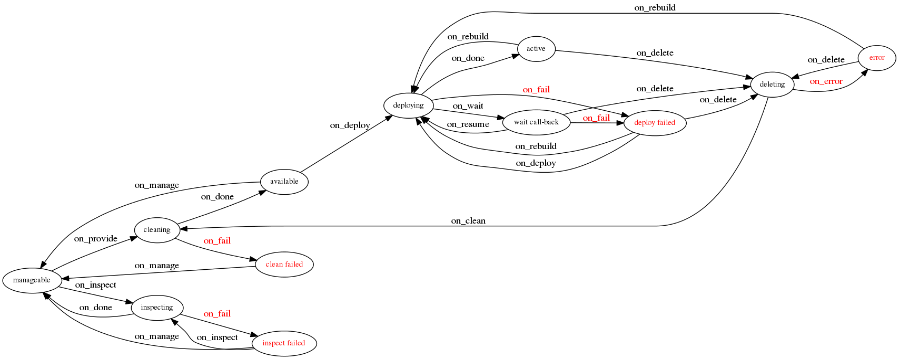

.. _states:

========================
Bare Metal State Machine
========================

State Machine Diagram
=====================

The diagram below shows the provisioning states that an Ironic node goes
through during the lifetime of a node. The diagram also depicts the events
that transition the node to different states.

Stable states are highlighted with a thicker border. All transitions from
stable states are initiated by API requests. There are a few other
API-initiated-transitions that are possible from non-stable states.
The events for these API-initiated transitions are indicated with '(via API)'.
Internally, the conductor initiates the other transitions (depicted in gray).

.. note::
   There are aliases for some transitions:

   * ``deploy`` is an alias for ``active``.
   * ``undeploy`` is an alias for ``deleted``

Enrollment and Preparation
==========================

enroll (stable state)
  This is the state that all nodes start off in when created using API version
  1.11 or newer. When a node is in the ``enroll`` state, the only thing ironic
  knows about it is that it exists, and ironic cannot take any further action
  by itself. Once a node has its driver/interfaces and their required
  information set in ``node.driver_info``, the node can be transitioned to the
  ``verifying`` state by setting the node's provision state using the
  ``manage`` verb.

  See :doc:`/install/enrollment` for information on enrolling nodes.

verifying
  ironic will validate that it can manage the node using the information given
  in ``node.driver_info`` and with either the driver/hardware type and
  interfaces it has been assigned. This involves going out and confirming that
  the credentials work to access whatever node control mechanism they talk to.

manageable (stable state)
  Once ironic has verified that it can manage the node using the
  driver/interfaces and credentials passed in at node create time, the node
  will be transitioned to the ``manageable`` state. From ``manageable``, nodes
  can transition to:

  * ``manageable`` (through ``cleaning``) by setting the node's provision state
    using the ``clean`` verb.
  * ``manageable`` (through ``inspecting``) by setting the node's provision
    state using the ``inspect`` verb.
  * ``available`` (through ``cleaning`` if automatic cleaning is enabled) by
    setting the node's provision state using the ``provide`` verb.
  * ``active`` (through ``adopting``) by setting the node's provision state
    using the ``adopt`` verb.

  ``manageable`` is the state that a node should be moved into when any updates
  need to be made to it such as changes to fields in driver_info and updates to
  networking information on ironic ports assigned to the node.

  ``manageable`` is also the only stable state that can be transitioned to,
  from these failure states:

  * ``adopt failed``
  * ``clean failed``
  * ``inspect failed``

inspecting
  ``inspecting`` will utilize node introspection to update hardware-derived
  node properties to reflect the current state of the hardware. Typically,
  the node will transition to ``manageable`` if inspection is synchronous,
  or ``inspect wait`` if asynchronous. The node will transition to
  ``inspect failed`` if error occurred.

  See :doc:`/admin/inspection` for information about inspection.

inspect wait
  This is the provision state used when an asynchronous inspection is in
  progress. A successfully inspected node shall transition to ``manageable``
  state.

inspect failed
  This is the state a node will move into when inspection of the node fails. From
  here the node can transitioned to:

  * ``inspecting`` by setting the node's provision state using the ``inspect``
    verb.
  * ``manageable`` by setting the node's provision state using the ``manage``
    verb

cleaning
  Nodes in the ``cleaning`` state are being scrubbed and reprogrammed into a
  known configuration.

  When a node is in the ``cleaning`` state it means that the conductor is
  executing the clean step (for out-of-band clean steps) or preparing the
  environment (building PXE configuration files, configuring the DHCP, etc)
  to boot the ramdisk for running in-band clean steps.

clean wait
  Just like the ``cleaning`` state, the nodes in the ``clean wait`` state are
  being scrubbed and reprogrammed. The difference is that in the ``clean wait``
  state the conductor is waiting for the ramdisk to boot or the clean step
  which is running in-band to finish.

  The cleaning process of a node in the ``clean wait`` state can be interrupted
  by setting the node's provision state using the ``abort`` verb if the task
  that is running allows it.

Deploy and Undeploy
===================

available (stable state)
  After nodes have been successfully preconfigured and cleaned, they are moved
  into the ``available`` state and are ready to be provisioned. From
  ``available``, nodes can transition to:

  * ``active`` (through ``deploying``) by setting the node's provision state
    using the ``active`` or ``deploy`` verbs.
  * ``manageable`` by setting the node's provision state using the ``manage``
    verb

deploying
  Nodes in ``deploying`` are being prepared to run a workload on them. This
  consists of running a series of tasks, such as:

  * Setting appropriate BIOS configurations
  * Partitioning drives and laying down file systems.
  * Creating any additional resources (node-specific network config, a config
    drive partition, etc.) that may be required by additional subsystems.

  See :doc:`/user/deploy` and :doc:`/admin/node-deployment` for information
  about deploying nodes.

wait call-back
  Just like the ``deploying`` state, the nodes in ``wait call-back`` are being
  deployed. The difference is that in ``wait call-back`` the conductor is
  waiting for the ramdisk to boot or execute parts of the deployment which
  need to run in-band on the node (for example, installing the bootloader, or
  writing the image to the disk).

  The deployment of a node in ``wait call-back`` can be interrupted by setting
  the node's provision state using the ``deleted`` or ``undeploy`` verbs.

deploy failed
  This is the state a node will move into when a deployment fails, for example
  a timeout waiting for the ramdisk to PXE boot. From here the node can be
  transitioned to:

  * ``active`` (through ``deploying``) by setting the node's provision state
    using the ``active``, ``deploy`` or ``rebuild`` verbs.
  * ``available`` (through ``deleting`` and ``cleaning``) by setting the
    node's provision state using the ``deleted`` or ``undeploy`` verbs.

active (stable state)
  Nodes in ``active`` have a workload running on them. ironic may collect
  out-of-band sensor information (including power state) on a regular basis.
  Nodes in ``active`` can transition to:

  * ``available`` (through ``deleting`` and ``cleaning``) by setting the node's
    provision state using the ``deleted`` or ``undeploy`` verbs.
  * ``active`` (through ``deploying``) by setting the node's provision state
    using the ``rebuild`` verb.
  * ``rescue`` (through ``rescuing``) by setting the node's provision state
    using the ``rescue`` verb.

deleting
  Nodes in ``deleting`` state are being torn down from running an active
  workload. In ``deleting``, ironic tears down and removes any configuration and
  resources it added in ``deploying`` or ``rescuing``.

error (stable state)
  This is the state a node will move into when deleting an active deployment
  fails. From ``error``, nodes can transition to:

  * ``available`` (through ``deleting`` and ``cleaning``) by setting the node's
    provision state using the ``deleted`` or ``undeploy`` verbs.

adopting
  This state allows ironic to take over management of a baremetal node with an
  existing workload on it. Ordinarily when a baremetal node is enrolled and
  managed by ironic, it must transition through ``cleaning`` and ``deploying``
  to reach ``active`` state. However, those baremetal nodes that have an
  existing workload on them, do not need to be deployed or cleaned again, so
  this transition allows these nodes to move directly from ``manageable`` to
  ``active``.

  See :doc:`/admin/adoption` for information about this feature.

Rescue
======

rescuing
  Nodes in ``rescuing`` are being prepared to perform rescue operations.
  This consists of running a series of tasks, such as:

  * Setting appropriate BIOS configurations.
  * Creating any additional resources (node-specific network config, etc.) that
    may be required by additional subsystems.

  See :doc:`/admin/rescue` for information about this feature.

rescue wait
  Just like the ``rescuing`` state, the nodes in ``rescue wait`` are being
  rescued. The difference is that in ``rescue wait`` the conductor is
  waiting for the ramdisk to boot or execute parts of the rescue which
  need to run in-band on the node (for example, setting the password for
  user named ``rescue``).

  The rescue operation of a node in ``rescue wait`` can be aborted by
  setting the node's provision state using the ``abort`` verb.

rescue failed
  This is the state a node will move into when a rescue operation fails,
  for example a timeout waiting for the ramdisk to PXE boot. From here the
  node can be transitioned to:

  * ``rescue`` (through ``rescuing``) by setting the node's provision state
    using the ``rescue`` verb.
  * ``active`` (through ``unrescuing``) by setting the node's provision state
    using the ``unrescue`` verb.
  * ``available`` (through ``deleting``) by setting the node's provision state
    using the ``deleted`` verb.

rescue (stable state)
  Nodes in ``rescue`` have a rescue ramdisk running on them. Ironic may collect
  out-of-band sensor information (including power state) on a regular basis.
  Nodes in ``rescue`` can transition to:

  * ``active`` (through ``unrescuing``) by setting the node's provision state
    using the ``unrescue`` verb.
  * ``available`` (through ``deleting``) by setting the node's provision state
    using the ``deleted`` verb.

unrescuing
  Nodes in ``unrescuing`` are being prepared to transition to ``active`` state
  from ``rescue`` state. This consists of running a series of tasks, such as
  setting appropriate BIOS configurations such as changing boot device.

unrescue failed
  This is the state a node will move into when an unrescue operation fails.
  From here the node can be transitioned to:

  * ``rescue`` (through ``rescuing``) by setting the node's provision state
    using the ``rescue`` verb.
  * ``active`` (through ``unrescuing``) by setting the node's provision state
    using the ``unrescue`` verb.
  * ``available`` (through ``deleting``) by setting the node's provision state
    using the ``deleted`` verb.
